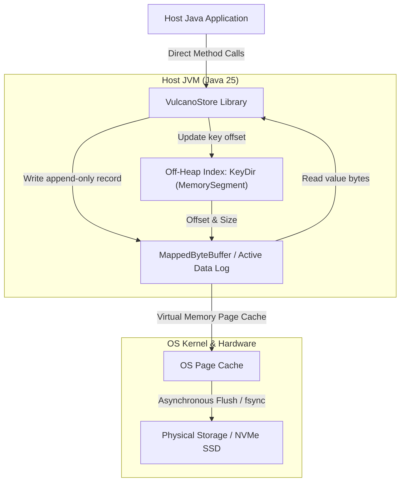

# VulcanoStore

VulcanoStore is a production-quality, ultra-fast, in-process key-value database library engineered for Java 25. Inspired by Basho's Bitcask paper, VulcanoStore operates entirely within the caller's JVM thread—completely bypassing thread synchronization and GC latency to deliver sub-microsecond point point operations at high throughput.

---

## 🏗️ Core Architecture & Tech Stack



### Key Architectural Decisions:
1. **Contention-Free Context:** Designed as thread-unsafe, avoiding CPU cache-line bouncing, context switches, and volatile read/write overhead by executing point operations inside a single dedicated thread context.
2. **JEP 454 Off-Heap index (`OffHeapKeyDir`):** Uses Java 25 Foreign Function & Memory (FFM) APIs to keep keys space metadata in a flat, contiguous `MemorySegment` managed by a `Shared Arena`. It is entirely invisible to the JVM Garbage Collector, eliminating "Stop-the-World" pauses. Key capacity is bounded physically by `maxKeyMemoryMb`, dynamically tracking memory bytes and throwing `VulcanoKeyMemoryLimitExceededException` when the threshold is violated.
3. **Log-Structured Storage:** All write transactions sequentially append to memory-mapped `.data` segments using native off-heap `MappedByteBuffer` structures, turning random writes into zero-latency sequential flushes.
4. **Directory Boot Recovery & Hint Files:** Automatically scans data logs sequentially on startup to rebuild the in-memory index. Speeds up startup by writing companion `.hint` files (timestamp, record offset, key size, and key) upon segment close, permitting instant index populating without scanning raw values.
5. **Background Compaction (`Compactor`):** Runs a daemon worker thread that merges inactive segment logs, purges stale/overwritten entries, and atomically updates slot coordinate mappings.

---

## 🚀 API Usage Example

VulcanoStore exposes modern byte-array APIs to maximize performance and avoid heap allocations, along with convenient UTF-8 String wrappers.

```java
import es.nachobrito.vulcanostore.VulcanoConfig;
import es.nachobrito.vulcanostore.VulcanoStore;
import es.nachobrito.vulcanostore.VulcanoStoreImpl;
import java.io.IOException;
import java.nio.file.Paths;
import java.util.Optional;

public class Example {
    public static void main(String[] args) {
        // 1. Initialize DB Configuration
        VulcanoConfig config = VulcanoConfig.builder()
                .dbPath(Paths.get("/path/to/db/data"))
                .segmentSize(128 * 1024 * 1024)   // 128 MB log segments
                .maxKeyMemoryMb(128)              // 128 MB key memory limit
                .build();

        // 2. Open VulcanoStore (coordinates recovery and starts background compactor)
        try (VulcanoStore store = new VulcanoStoreImpl(config)) {
            
            // 3. Write data
            store.put("username", "nacho_brito");
            
            // 4. Verify existences
            if (store.exists("username")) {
                System.out.println("Key exists!");
            }

            // 5. Read data
            Optional<String> username = store.get("username");
            username.ifPresent(val -> System.out.println("Retrieved: " + val));

            // 6. Delete data
            boolean deleted = store.delete("username");
            System.out.println("Deleted successfully: " + deleted);

        } catch (IOException e) {
            e.printStackTrace();
        }
    }
}
```

---

## ⚙️ Configuration Parameters

VulcanoStore is configured using `VulcanoConfig.builder()`. Below is the complete explanation of all configuration parameters:

| Parameter | Type | Default Value | Recommended Value | Description & Internal Usage |
| :--- | :--- | :--- | :--- | :--- |
| `dbPath` | `Path` | *Required* | System-dependent | **Purpose:** The filesystem directory where segment logs and index hint files are persisted.<br>**Internal Usage:** `StorageEngine` uses this path to scan and locate existing logs during boot recovery, write active `.data` segments, serialize `.hint` companion files, and perform inactive segment compaction merges. |
| `segmentSize` | `long` | `134,217,728` (128 MB) | `134,217,728` (128 MB) | **Purpose:** The maximum byte size limit for a single sequential log segment file on disk.<br>**Internal Usage:** `StorageEngine` tracks `writeOffset` inside the active segment's `MappedByteBuffer`. Writing a record that pushes the offset past `segmentSize` triggers a transparent segment rollover: the active file is closed, a compact `.hint` file is generated, and a fresh incremented segment is opened. |
| `maxKeyMemoryMb` | `long` | `128` (128 MB) | Workload-dependent | **Purpose:** The maximum off-heap physical RAM allocated for active unique keys in the database.<br>**Internal Usage:** Allocates the contiguous JEP 454 off-heap `keysSegment` exactly to this size. Sizes the open-addressing index slots assuming a conservative 24-byte key size estimate. Unique key memory usage is tracked logically. Inserting a new key that would exceed `maxKeyMemoryMb` immediately throws a custom `VulcanoKeyMemoryLimitExceededException` to safeguard against off-heap memory overflows. |
| `syncStrategy` | `SyncStrategy` | `SYNC_INTERVAL` | `SYNC_INTERVAL` | **Purpose:** The synchronization strategy for flushing native memory-mapped pages back to physical storage, defining the database durability profile.<br>**Internal Usage:**<br>- `SYNC_ALWAYS`: Invokes `MappedByteBuffer.force()` on the active segment after every single write transaction. Guaranteed durability at the expense of write throughput.<br>- `SYNC_INTERVAL`: A background daemon thread periodically invokes `force()` at a configured interval. Balances safety and high throughput.<br>- `SYNC_NONE`: Relies entirely on the OS virtual memory layer's standard dirty page flush cycle. Maximum speed, but vulnerable to power-loss data loss. |
| `syncIntervalMs` | `long` | `500` (500 ms) | `500` ms | **Purpose:** The periodic interval in milliseconds for background page cache flushing.<br>**Internal Usage:** A background daemon thread pools active segments and invokes `MappedByteBuffer.force()` every `syncIntervalMs` milliseconds. Only active when `syncStrategy` is set to `SYNC_INTERVAL`. |

---

## 🚦 How to Build & Run Tests

VulcanoStore utilizes a strict **Test-Driven Development (TDD)** workflow. The entire test suite consists of unit, integration, and concurrency tests compiling under modern **Java 25** compiler targets and **JUnit 5**.

To run all automated verification tests:
```bash
mvn clean test
```

Test suites cover:
* `OffHeapKeyDirTest` – assertions for open-addressing, linear-probing wrapping, collision resolutions, and arena deallocations.
* `BinaryRecordTest` – record header serialization, deserialization, and tombstones.
* `FileSegmentTest` – memory-mapped byte buffer reads, sequential appends, and slice position isolations.
* `StorageEngineTest` – segment rollover capacities, historic boot scanning, and multi-segment crash recovery.
* `CompactorTest` – stale records purging, inactive segment cleanup, and multi-thread concurrent index swap atomicity.
* `VulcanoStoreTest` – programmatic lifecycle CRUD wrappers.

---

## ⚡ How to Run Profiling & Microbenchmarks

VulcanoStore comes equipped with a GC-centric profiling tool that measures point PUT and GET throughput and latency under warm-up JIT compilers, while monitoring JVM Garbage Collection MXBeans to verify the zero-GC profile.

To execute the profiling tool:
```bash
mvn exec:java -Dexec.mainClass="es.nachobrito.vulcanostore.benchmark.VulcanoBenchmark" -Dexec.classpathScope="test"
```

### Reference Metrics (NVMe SSD Local Run):
* **Write (PUT) Throughput:** ~`612,000` ops/sec
* **Read (GET) Throughput:** ~`1,775,000` ops/sec
* **Write Latency:** `1.6 microseconds` average (99th percentile: `7.9 microseconds`)
* **Read Latency:** `0.6 microseconds` average (99th percentile: `4.1 microseconds`)
* **JVM GC Pause Duration:** **`0 milliseconds`** (exactly `0` GC collections)
