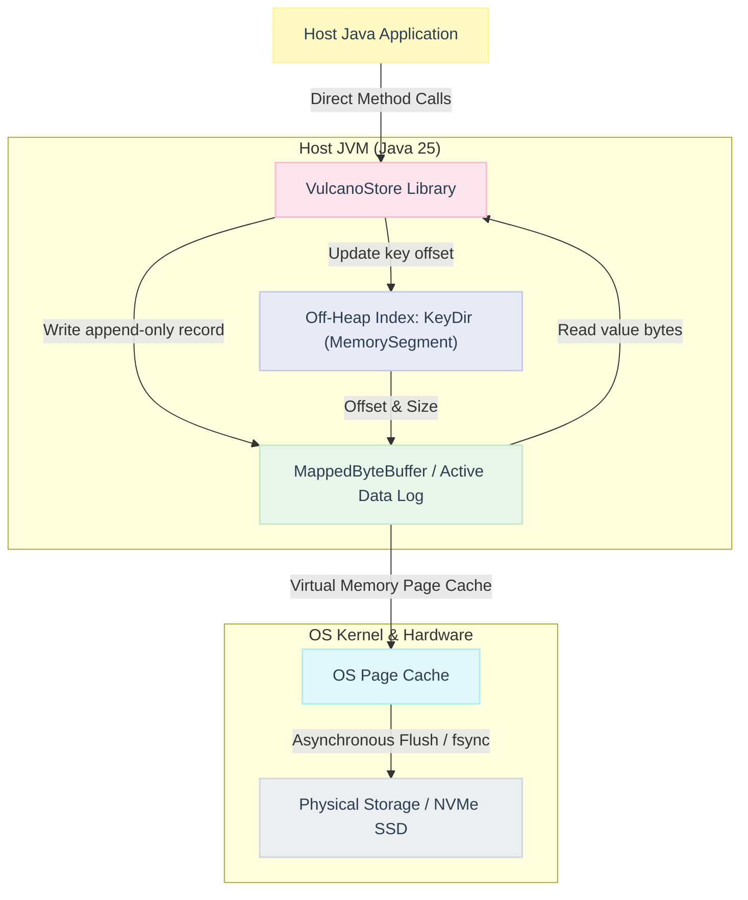

# VulcanoStore: Design & Architecture Document (Embedded Library)

VulcanoStore is an ultra-high performance, single-threaded (contention-free), persistent key-value store designed as an **in-process embedded Java library**. Inspired by Basho’s Bitcask log-structured storage engine, VulcanoStore is engineered to deliver sub-millisecond point lookups and high-throughput append-only writes, with durability guarantees starting the moment data enters the OS page cache—directly within your JVM application process.

---

## 1. Executive Summary & Design Philosophy

Traditional embedded databases suffer from concurrency bottlenecks and high locking overhead. VulcanoStore is designed as a **thread-unsafe, ultra-fast local library** meant to be called within a single dedicated worker thread (or synchronized externally by the host application). This avoids all concurrency lock overhead, context-switching, and cache-line bouncing.

### Core Design Principles:
1. **Contention-Free Single-Threaded Context:** By executing in a single thread context, the library bypasses synchronized blocks, volatile read/writes, and reentrant locks, maximizing CPU pipeline and L1/L2 cache locality.
2. **Log-Structured Storage Engine (Bitcask):** Writes are strictly append-only. Every `put` or `delete` operation appends a sequential record to the active segment file, converting slow random write operations into zero-latency sequential writes.
3. **In-Memory Hash Index (KeyDir):** A highly optimized in-memory index maps all keys to their precise location (file ID, offset, and size) in the data logs. Direct lookups are $O(1)$ and require at most a single disk seek.
4. **No Networking Overhead:** Since VulcanoStore operates in-process, it completely avoids TCP/IP stack overhead, system socket calls, thread scheduling context switches, and network serialization costs.

---

## 2. Programmatic Java API

VulcanoStore exposes a clean, developer-friendly Java interface. The library natively supports byte array operations to maximize performance and avoid garbage collection overhead, while offering convenient String-based methods.

```java
package es.nachobrito.vulcanostore;

import java.io.IOException;
import java.util.Optional;

public interface VulcanoStore extends AutoCloseable {
    
    /**
     * Stores the key-value pair in the database.
     */
    void put(byte[] key, byte[] value) throws IOException;
    
    /**
     * Stores the key-value pair with a UTF-8 String representation.
     */
    default void put(String key, String value) throws IOException {
        put(key.getBytes(java.nio.charset.StandardCharsets.UTF_8), 
            value.getBytes(java.nio.charset.StandardCharsets.UTF_8));
    }

    /**
     * Retrieves the value associated with the key.
     */
    Optional<byte[]> get(byte[] key) throws IOException;
    
    /**
     * Retrieves the String value associated with the key.
     */
    default Optional<String> get(String key) throws IOException {
        return get(key.getBytes(java.nio.charset.StandardCharsets.UTF_8))
                .map(bytes -> new String(bytes, java.nio.charset.StandardCharsets.UTF_8));
    }

    /**
     * Deletes the key-value pair from the store.
     * Returns true if the key existed and was marked deleted; false otherwise.
     */
    boolean delete(byte[] key) throws IOException;
    
    default boolean delete(String key) throws IOException {
        return delete(key.getBytes(java.nio.charset.StandardCharsets.UTF_8));
    }

    /**
     * Checks if the key exists in the store.
     */
    boolean exists(byte[] key);
    
    default boolean exists(String key) {
        return exists(key.getBytes(java.nio.charset.StandardCharsets.UTF_8));
    }

    /**
     * Closes the storage engine, flushing active buffers and releasing memory maps.
     */
    @Override
    void close() throws IOException;
}
```

---

## 3. High-Level Architecture

The embedded architecture runs entirely inside the host JVM process, directly mapping files off-heap to minimize GC pressure.



### 3.1. Storage Layer: Zero-Copy MappedByteBuffer
VulcanoStore utilizes Java's `MappedByteBuffer` to achieve high-throughput, low-latency disk interactions.
* **Zero-Copy writes/reads:** The OS directly maps parts of the data files into the JVM's virtual address space. Writes are simple memory stores, which are exceptionally fast.
* **GC-Exempt Off-Heap Storage:** The actual data values remain off the JVM heap, keeping garbage collection (GC) cycles ultra-short and predictable.
* **OS-Driven Page Cache Management:** The operating system's virtual memory subsystem manages page flushing, leveraging years of filesystem optimizations.

### 3.2. State-of-the-Art In-Memory Index: Off-Heap FFM `KeyDir`
To scale beyond millions of keys without hitting Garbage Collection limits or pointer-chasing latency, VulcanoStore implements its `KeyDir` using Java 25's **Foreign Function & Memory (FFM) API (JEP 454)**.
* **Contiguous Allocation:** The keys index is allocated off-heap as a flat contiguous `MemorySegment` managed by a `Confined Arena`.
* **Zero-GC Overhead:** Because the index is off-heap, it is entirely invisible to the JVM Garbage Collector, eliminating the multi-second "Stop-the-World" pauses that occur when tracing standard Java heap maps (`HashMap<String, KeyEntry>`) containing tens of millions of objects.
* **Cache-Local Linear Probing:** Uses a flat open-addressed hash map structure. Linear probing guarantees that colliding records are stored sequentially in adjacent memory slots, fully capitalizing on CPU L1/L2 data prefetching.

### 3.3. Static Sizing & `maxKeyMemoryMb` Rationale
In open-addressed hash tables, dynamic resizing (reallocating a larger off-heap block and copying/re-hashing all active slots) is extremely costly and introduces sudden, massive latency spikes. 

To maintain strict sub-millisecond point write guarantees, VulcanoStore utilizes a **static, pre-sized off-heap layout** based on the configured key memory limit (`maxKeyMemoryMb`):
*   **Physical Key Buffer Allocation:** The flat `keysSegment` (storing the raw key bytes) is allocated with exactly `maxKeyMemoryMb` MB in bytes:
    $$\text{maxKeyMemoryBytes} = \text{maxKeyMemoryMb} \times 1024 \times 1024 \text{ bytes}$$
*   **Slots Allocation Sizing Formula:** To determine the safe number of open-addressing slots, the engine calculates target capacity using the configured `averageKeySize` in bytes (which defaults to **36 bytes**, representing the length of a canonical UUID string, but can be customized or defaults to 24 bytes for direct/legacy index instances):
    $$\text{expectedKeys} = \frac{\text{maxKeyMemoryBytes}}{\text{averageKeySize}}$$
    $$\text{Total Slots} = \frac{\text{expectedKeys}}{\text{Load Factor}} = \frac{\text{expectedKeys}}{0.7}$$
*   **Example (Default Config - 128 MB and 36-byte average key size):** For the default capacity of `maxKeyMemoryMb = 128` and `averageKeySize = 36` (UUID length), VulcanoStore allocates exactly:
    $$\text{maxKeyMemoryBytes} = 128 \times 1024 \times 1024 = 134,217,728 \text{ bytes}$$
    $$\text{expectedKeys} = \frac{134,217,728}{36} = 3,728,270 \text{ keys}$$
    $$\text{Total Slots} = \frac{3,728,270}{0.7} = 5,326,100 \text{ slots}$$
    which translates to $\sim 243.8$ MB of off-heap slots segment memory on startup (a $\sim 33\%$ reduction compared to the legacy 24-byte default of $\sim 365$ MB).

This design decision guarantees a highly predictable memory footprint, zero runtime resizing overhead, and perfectly flat latency profiles throughout the lifecycle of the database.

### 3.4. Key Memory Limit Exhaustion Safety Boundaries
Because the off-heap mapping uses a fixed-size slot array under open-addressing and a physical contiguous key bytes segment, approaching a 100% capacity would trigger dangerous memory overflows or massive collision chains. To guarantee production reliability, VulcanoStore enforces a **strict safety boundary**:
1.  **Memory Usage Tracking:** The database dynamically tracks the sum of lengths of active unique keys in bytes (`activeKeysMemoryBytes`).
2.  **Granular Rejections:** If calling `put` with a **new key** (not already present in the index) would push `activeKeysMemoryBytes + key.length` beyond `maxKeyMemoryBytes`, it throws a custom `VulcanoKeyMemoryLimitExceededException` (which extends `IllegalStateException`).
3.  **Existing Key Overwrites Permitted:** Updates to **existing keys** remain fully functional and succeed even when the capacity is reached, because they overwrite their existing slot and do not consume additional memory in the off-heap index.
4.  **Memory Reclamation on Deletions**: Calling `delete` on an active key removes it from the index and immediately reclaims its key byte size, freeing up capacity for subsequent new key insertions.

---

## 4. KeyDir Entry Layout & Technical Design Decisions

To make VulcanoStore production-quality and scale-resilient, the in-memory index avoids standard Java Object reference trees. Instead, it operates on fixed-size **42-byte slots** in a single contiguous `MemorySegment`:

```text
+-------------------+-------------------+-------------------+-------------------+-------------------+-------------------+-------------------+
| Hash (8B)         | File ID (4B)      | Val Size (4B)     | Val Offset (8B)   | Key Offset (8B)   | Timestamp (8B)    | Key Size (2B)     |
+-------------------+-------------------+-------------------+-------------------+-------------------+-------------------+-------------------+
```

### 4.1. Slot Fields & Rationale

1. **Key Hash (8 bytes - `long`):** 64-bit MurmurHash3 / CityHash of the key. `0` represents an empty slot.
   * *Rationale:* Allows instant comparison during lookups. We only read data files or perform detailed checks if this hash matches, avoiding expensive disk reads for mismatched keys.
2. **File ID (4 bytes - `int`):** The data segment file number.
   * *Rationale:* Efficiently fits up to 2.14 billion individual data segment files on disk.
3. **Value Size (4 bytes - `int`):** Byte length of the value.
   * *Rationale:* Accommodates values up to 2 GB (standard JVM array size limit).
4. **Value Offset (8 bytes - `long`):** File offset of the record on disk.
   * *Rationale:* Accommodates exabyte-scale databases.
5. **Key Offset (8 bytes - `long`):** File offset of the key on disk.
   * *Rationale:* Used to locate the exact key bytes in the memory-mapped segment file to resolve hash collisions without storing keys off-heap, preserving off-heap RAM space.
6. **Timestamp (8 bytes - `long`):** Epoch millisecond of the write.
   * *Rationale:* Critical for compaction merging (identifying the latest version of a key) and time-to-live expiration checks.
7. **Key Size (2 bytes - `short`):** Byte length of the key.
   * *Rationale:* Allows keys up to 65,535 bytes ($64\text{ KB}$), sufficient for standard usage.

### 4.2. Open-Addressing Lookup Algorithm (`GET`)

1. **Hash the Key:** Compute 64-bit hash (e.g. MurmurHash3) of the target key (`H`).
2. **Locate Base Slot:** Compute starting slot index: `index = H % totalSlots`.
3. **Probe Contiguous Memory:**
   * Read the stored `Key Hash` at `index * 42` bytes from the `MemorySegment`.
   * **Case A: It is `0` (Empty slot):** Key is not present. Stop and return `Optional.empty()`.
   * **Case B: It matches `H` (Collision / Match Candidate):**
     * Retrieve `Key Offset` and `Key Size` from the slot.
     * Read the key bytes from the mapped data segment file (served from OS page cache) and perform a fast byte-by-byte compare (`Arrays.equals()`).
     * **If identical:** Return value metadata (`fileId`, `valueSize`, `valueOffset`).
     * **If different (Hash Collision):** Increment index (`index = (index + 1) % totalSlots`) and repeat probe.
   * **Case C: It is a different non-zero hash:** A collision has occurred. Increment index (`index = (index + 1) % totalSlots`) and repeat probe.

---

## 5. Consistency & Durability Guarantees

Memory consistency is guaranteed the moment data is successfully written to the `MappedByteBuffer`. VulcanoStore leverages the OS virtual memory layer to achieve this efficiently:

1. **Application Crash Resilience:** Since data is written to a memory-mapped file (`MappedByteBuffer`), the data resides in the OS kernel's Page Cache. If the JVM process crashes or is forcefully killed (`kill -9`), the OS guarantees that the dirty memory pages are flushed to the disk. Zero data loss occurs upon application restarts.
2. **Power Loss Resilience (Sync Configurations):**
    * **`SYNC_ALWAYS` (Strict):** Calling `MappedByteBuffer.force()` after every `put` or `delete`. Highly durable, but throttled by disk write latencies.
    * **`SYNC_INTERVAL` (Balanced):** A background thread periodically invokes `force()` (e.g., every 500ms or 1s). This provides a bound on data loss under sudden power failure while retaining high write throughput.
    * **`SYNC_NONE` (Maximum Speed):** The OS decides when to flush pages (usually every 30 seconds). Maximum performance, zero system call overhead.

---

## 6. High-Performance Optimizations & Research Insights

### 6.1. Hint Files for Near-Instant Startup
Scanning multi-gigabyte data files sequentially on startup to rebuild the `KeyDir` is extremely slow. VulcanoStore implements **Hint Files**:
* When an active log file is closed, a companion `.hint` file is written.
* The hint file contains the exact `KeyEntry` structures (key, fileId, offset, size, timestamp) but **omits the actual values**.
* On startup, VulcanoStore scans the `.hint` files first. Rebuilding the index from hint files is up to $100\times$ faster because they are extremely compact.

### 6.2. Background Merge (Compaction)
Append-only logs naturally accumulate stale data (e.g., old versions of updated keys or tombstone markers for deleted keys). VulcanoStore implements a clean, lock-free **Background Merge Processor**:
1. A background thread scans inactive data files.
2. It cross-references each record with the current active `KeyDir`.
3. If the record in the file matches the latest entry in the `KeyDir`, it writes the record to a new, compacted data log file.
4. When finished, the background thread commits these updates to `KeyDir` atomically by swapping file IDs and offsets.

---

## 7. Storage File Format Specification

Data is stored in binary files. The layout is optimized for rapid parsing and direct aligned memory reads.

### 7.1. Data Log Format (`*.data`)
Every record appended to the data file follows this binary layout:

```text
+-------------------+-------------------+-------------------+-------------------+-------------------+-------------------+
| Timestamp (8B)    | Key Size (2B)     | Value Size (4B)   | Expiry (8B)       | Key (Var)         | Value (Var)       |
+-------------------+-------------------+-------------------+-------------------+-------------------+-------------------+
```

### 7.2. Hint File Format (`*.hint`)
For rapid startup, the corresponding hint files use the following layout:

```text
+-------------------+-------------------+-------------------+-------------------+-------------------+
| Timestamp (8B)    | Offset (8B)       | Value Size (4B)   | Key Size (2B)     | Key (Var)         |
+-------------------+-------------------+-------------------+-------------------+-------------------+
```

---

## 8. Summary of Classes & Component Architecture

1. **`VulcanoStore` (Interface)**: Defines the programmatic API for the in-process key-value store.
2. **`VulcanoStoreImpl`**: The concrete class implementing `VulcanoStore`, coordinating directory configuration, `KeyDir`, and `StorageEngine`.
3. **`OffHeapKeyDir`**: The custom off-heap linear-probing index utilizing Java 25 FFM APIs (`MemorySegment`).
4. **`StorageEngine`**: Manages active/inactive `MappedByteBuffer` logs, write appends, read offsets, and startup initialization/rebuild.
5. **`Compactor`**: Background thread that handles the merging of inactive log files.

---

## 9. References & Further Reading

*   **[Bitcask Paper (Basho)](https://riak.com/assets/bitcask-intro.pdf):** The foundational whitepaper introducing the Log-Structured Hash Table design, KeyDir index, and log file compaction.
*   **[Log-Structured Merge-Tree (LSM) Paper (O'Neil et al.)](https://www.cs.umb.edu/~poneil/lsmtree.pdf) ([Alt Link](https://www.semanticscholar.org/paper/The-log-structured-merge-tree-(LSM-tree)-ONeil-Cheng/12627452)):** The landmark research paper presenting the LSM-Tree model, optimizing write-heavy workloads via sequential memory flushes and sorted disk hierarchies.
*   **[Java NIO MappedByteBuffer API Documentation](https://docs.oracle.com/en/java/javase/23/docs/api/java.base/java/nio/MappedByteBuffer.html):** Official documentation detailing the Java Direct Byte Buffer mapped to a file, enabling high-performance zero-copy memory operations.
*   **[mmap System Call Reference (POSIX/Linux)](https://man7.org/linux/man-pages/man2/mmap.2.html):** Standard Linux developer documentation describing how files or devices are mapped directly into system virtual memory pages to avoid user-to-kernel boundary copy overhead.
